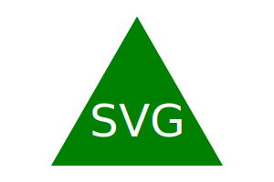

# Logo Maker 

## Technology Used

| Technology Used              |                                                                             Resource URL                                                                             |
| ---------------------------- | :------------------------------------------------------------------------------------------------------------------------------------------------------------------: |
| Node.js                      |                            [https://nodejs.org/docs/latest/api/documentation.html](https://nodejs.org/docs/latest/api/documentation.html)                            |
| Inquirer v.8.2.4 npm package | [https://github.com/SBoudrias/Inquirer.js/blob/master/packages/inquirer/README.md](https://github.com/SBoudrias/Inquirer.js/blob/master/packages/inquirer/README.md) |
| Jest npm package             |                                           [https://jestjs.io/docs/getting-started](https://jestjs.io/docs/getting-started)                                           |
| Git                          |                                                             [https://git-scm.com/](https://git-scm.com/)                                                             |

## Description

This is a simple logo maker that will create a logo based on the users choices of color, text and shape. The logo will be generated in a svg file.

## Table of Contents

- [Installation](#installation)
- [Usage](#usage)
- [Tests](#tests)
- [License](#license)
- [Questions](#questions)
- [Author Info](#author-info)

## Installation

To install simply run 'npm install' in terminal to install dependencies.

## Usage

Once project is properly installed, run 'node index.js' in terminal. This will begin a series of prompts that need to be answered by the user (seen in image 1a.). Once the user answers all the prompts, a logo will be generated in an svg file. Below are examples of logos generated.

image 1a.

## Tests

To run tests from shapes.test.js file, simply run 'npm run test' in terminal.

## License

This project is covered under the MIT License. For more information about license go to [https://mit-license.org/](https://mit-license.org/)

## Questions

If there are additional questions, you may contact me at jorgecastro619@gmail.com or visit my [GitHub](https://github.com/Jacastro619)

## Author Info

Created by Jorge Castro, a student at UC Berkeley Full Stack Coding Academy. For more information go to https://bootcamp.berkeley.edu/coding/

- [Portfolio](https://jacastro619.github.io/my-portfolio/)

- [LinkedIn](https://www.linkedin.com/in/jorge-castro-2a9545177/)

- [GitHub](https://www.linkedin.com/in/jorge-castro-2a9545177/)
